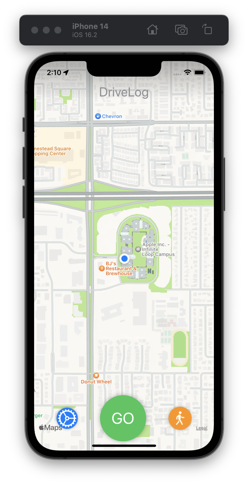
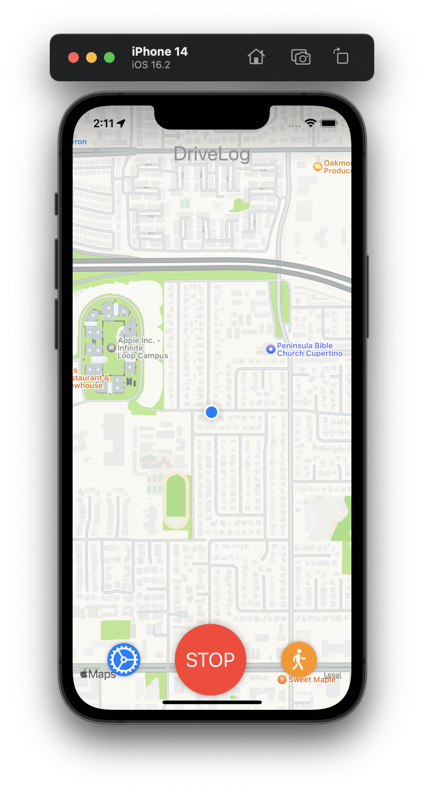
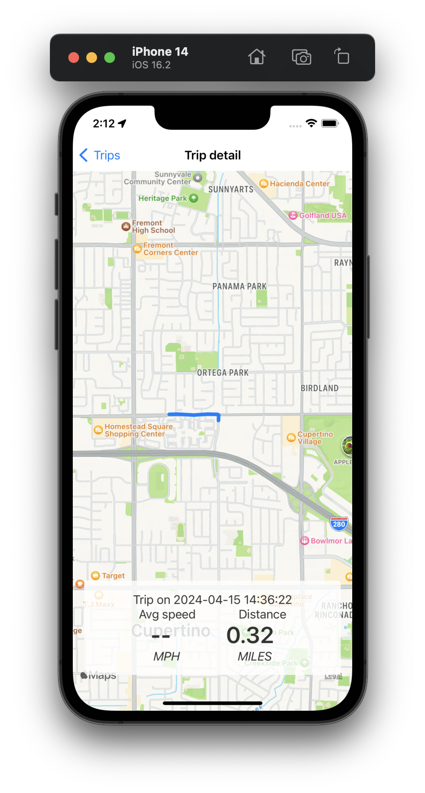

# DriveLog
A simple trip tracker for cars and motorcycles. 

## Functions
- Record trips
- Displays real time speed while recording trip
- Displays trips on a map view with information about the trip
- Ability to export trip data

## Future plans
- Ability to import/restore trip data
- Share trips with others
- Turn-by-turn navigation?

## Screenshots (v1.0)
<table>
  <tr>
    <td align="center"> 
Default view
</td>
    <td align="center"> 
Record view
</td>
    <td align="center"> 
Trip list view
</td>
  </tr>
  <tr>
    <td align="center"> 
Trip detail view
</td>
    <td align="center"> 
Settings view
</td>
    <td></td> <!-- Add an empty cell if the number of screenshots is odd -->
  </tr>
</table>

